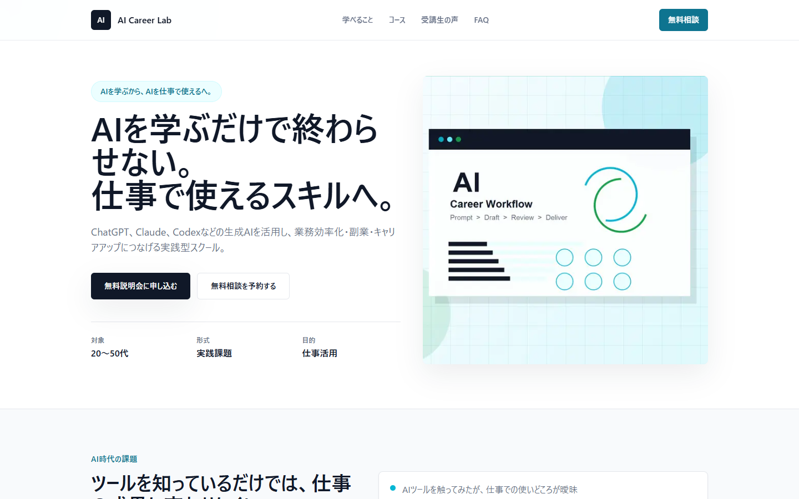
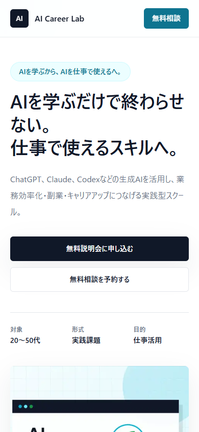

# AI School LP

AIスクール「AI Career Lab」を想定した、ポートフォリオ用の自主制作ランディングページです。

## Overview

このLPは、AIに興味はあるものの「何から始めればよいか分からない」「自分でも学べるのか不安」という初心者が、安心して無料説明会・無料相談への申し込みを検討できる状態を目指して制作しました。

単にAIスクールらしいデザインを作るのではなく、学習前の不安を減らし、サービス内容と受講後のイメージを分かりやすく伝え、申し込みまで自然につなげる導線設計を重視しています。

## Demo

https://ai-school-lp-theta.vercel.app/

## Screenshots

### Desktop



### Mobile



## Project Goal

AIに興味はあるものの、まだ学習経験が少ない初心者が「自分にも学べそう」「仕事や副業に活かせそう」と感じ、無料説明会や無料相談へ進みやすくすることを目的とした自主制作LPです。

目的は、見た目のデザインだけで印象づけることではありません。学習への不安軽減、サービス内容の理解、受講後のイメージ形成、申し込みまでの導線改善を重視しました。

特に、AI学習サービスは内容が抽象的に見えやすいため、ファーストビュー、課題提示、学べること、コース紹介、受講生の声、学習ステップ、FAQ、CTAの順で情報を整理しています。

## Design Thinking

### 想定クライアント

- AIスクール
- プログラミングスクール
- リスキリングサービス
- オンライン教育事業者

### 想定ユーザー

- AIツールに興味はあるが、何から学べばよいか分からない初心者
- 仕事の効率化や副業準備にAIを活用したい会社員
- 生成AIを触ったことはあるが、実務での使いどころを整理できていない人

### 想定課題

- AI初心者が受講後をイメージしにくい
- 他スクールとの違いが分かりづらい
- サービス内容が複雑で理解しづらい
- 受講への心理的ハードルが高い
- 申込みまでの導線が弱い

これらの課題は、AI学習サービスが「何を学ぶか」だけでは価値を伝えきれず、受講後に自分の仕事や生活がどう変わるのかを想像しづらいことが原因だと仮定しました。

また、生成AI領域は情報量が多く、ツール名や専門用語も増えやすいため、初心者ほど「結局どこから始めればよいのか」が分かりにくくなります。そのため、教材の詳細説明よりも、まず対象者、学習ステップ、得られるアウトプット、相談導線を分かりやすく提示することを優先しました。

### 改善施策

#### 1. ファーストビューで対象者を明確化

ファーストビューでは「AIを学ぶから、AIを仕事で使えるへ」というコピーと、仕事活用を目的とした実践型スクールであることを最初に伝えました。

AI初心者は、自分が受講対象なのか、どのレベルから始められるのかに不安を感じやすいと考えました。そのため、初心者でも仕事や副業に活かす学習へ進めることを冒頭で示し、読み進める理由を作っています。

#### 2. 学習ステップを可視化

無料相談、基礎学習、実践課題、成果物づくりという流れを整理して掲載しました。

受講開始から学習完了までの流れが見えないと、初心者は申し込み前に不安を感じやすくなります。そこで、学習プロセスを段階化し、何をどの順番で進めるのかを把握しやすい構成にしました。

#### 3. ベネフィットを具体化

「生成AIの基礎理解」「業務効率化の設計」「成果物づくり」など、学習内容を実務のアウトプットに結びつけて説明しました。

単に学べる内容を並べるだけでは、受講後の価値が伝わりにくいと考えました。そのため、AIツールを知ることよりも、資料作成、リサーチ、文章作成、業務改善案、ポートフォリオ作成など、受講後に何ができるようになるかをイメージしやすくしています。

#### 4. CTAを分かりやすく配置

ヘッダー、ファーストビュー、最下部のCTAエリアに無料説明会・無料相談への導線を配置しました。

AI学習を検討するユーザーは、すぐ申し込みたい人だけでなく、まず自分に合うか相談したい人も多いと想定しました。そのため、無料説明会と無料相談の2つの入口を用意し、検討段階に合わせて自然に次の行動へ進める構成にしています。

### Expected Outcome

本作品は自主制作のため、実際の運用データや改善実績はありません。

一般的なLP改善・UI/UX・導線設計の考え方にもとづき、以下のような成果を狙った設計としています。

- サービス内容の理解向上が期待される
- 申込み率の向上につながるという仮説
- 無料相談への遷移率向上を狙う
- 受講への心理的ハードル低下が想定される

## Features

- 初心者向けであることを伝えるファーストビュー
- 無料説明会・無料相談へのCTA導線
- AI学習前の悩みを整理する課題提示セクション
- 学べる内容、コース、学習ステップ、FAQの情報整理
- 仕事活用・副業準備・成果物づくりを意識した訴求
- PC・スマートフォンに対応したレスポンシブデザイン
- ポートフォリオ用スクリーンショットの掲載

## Tech Stack

| Category | Technology |
|---|---|
| Framework | Next.js 16 |
| Language | TypeScript |
| Styling | Tailwind CSS |
| Deploy | Vercel |

## Local Development

```bash
npm install
npm run dev
```

ブラウザで `http://localhost:3000` を開いて確認できます。

```bash
npm run build
npm run lint
```

## Note

この作品はポートフォリオ用の自主制作です。「AI Career Lab」は架空のスクール名であり、実在するスクールの実績ではありません。

課題設定、改善施策、成果仮説は、一般的なLP改善・UI/UX・導線設計の考え方をもとに制作しています。実際の申込み増加、転職成功、副業収入、業務成果を保証するものではありません。

受講生の声、コース内容、無料説明会・無料相談の導線はサンプルです。実際に公開する場合は、実サービスの内容、掲載許可、表記ルールに合わせて差し替えてください。

誇大表現や成果保証につながるコピーは避け、初心者が安心して検討できる情報設計を意識しています。
